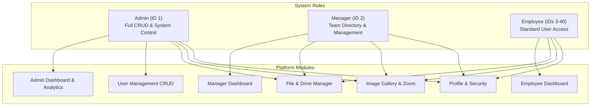

# 🌌 Antigravity Project Blueprint & System Architecture

> **Project Name:** UserManage (SaaS Core Platform)  
> **Engineered with:** Google DeepMind Antigravity Coding Assistant  
> **Target Framework:** Angular 21 (Signals & Standalone Architecture)  
> **Mock Backend:** JSON Server (`db.json` REST API on Port 3000)  
> **Test Framework:** Vitest + Angular TestBed  
> **Last Verification:** 100% Test Pass Rate (11/11 tests) | 0 Build Errors

---

## 🧭 Executive Summary

**UserManage** is a modern SaaS web application designed for enterprise user management, cloud file storage, interactive image galleries with loupe magnification, and strict 3-tier Role-Based Access Control (RBAC).

This document serves as the **Antigravity Blueprint** detailing the system topology, component tree, signal flows, security guards, database persistence, and optimization strategies implemented across the application.

---

## 🏗️ System Architecture & Directory Topology

```
d:/user-managment/
├── db.json                                # Mock REST API database (JSON Server)
├── package.json                           # Dependency manifest & npm scripts
├── angular.json                           # Angular build & architect configuration
├── PROJECT_DOCUMENTATION.md               # User & Developer Technical Documentation
├── ANTIGRAVITY.md                         # Antigravity Blueprint & Architecture Guide
├── src/
│   ├── main.ts                            # Application bootstrap
│   ├── index.html                         # Root HTML template
│   ├── styles.css                         # Global CSS tokens, custom scrollbars, typography
│   ├── environments/
│   │   ├── environment.ts                 # Local dev configuration (API URL: localhost:3000)
│   │   └── environment.prod.ts            # Production build configuration
│   └── app/
│       ├── app.routes.ts                  # Centralized router configuration with RBAC guards
│       ├── app.config.ts                  # App providers (HttpClient, Router, Animations)
│       ├── layout/
│       │   ├── app-shell.component.ts     # Main application layout shell with navbar & sidebar
│       │   ├── app-shell.component.html   # Shell template (sidebar, top greeting, user menu)
│       │   └── app-shell.component.css    # Flex layout, sticky headers, responsive drawers
│       ├── core/
│       │   ├── guards/                    # Route protection
│       │   │   ├── auth.guard.ts          # Session validator & returnUrl redirection
│       │   │   └── role.guard.ts          # RBAC permission enforcer
│       │   ├── interceptors/              # HTTP middleware
│       │   │   ├── auth.interceptor.ts    # Bearer token injector
│       │   │   ├── error.interceptor.ts   # Global error handling & toast dispatch
│       │   │   └── loading.interceptor.ts # Global loading progress state tracking
│       │   ├── models/                    # TypeScript interfaces & types
│       │   │   ├── user.model.ts          # Role ('admin' | 'manager' | 'employee'), User, Session
│       │   │   ├── drive.model.ts         # DriveNode (folder/file), breadcrumbs, stats
│       │   │   ├── image.model.ts         # ImageItem, upload payloads, dimensions
│       │   │   ├── filter.model.ts        # ActiveFilterState, FilterGroup, FilterOption
│       │   │   ├── pagination.model.ts    # PaginationParams, PaginatedResponse
│       │   │   └── table.model.ts         # TableColumn definitions, SortConfig
│       │   ├── services/                  # Business logic & API communication
│       │   │   ├── auth.service.ts        # Authentication, dynamic login, session sync
│       │   │   ├── user.service.ts        # User CRUD, pagination, multi-field search
│       │   │   ├── drive.service.ts       # Cloud folder hierarchy, file uploads, delete
│       │   │   ├── image.service.ts       # Batch image upload, base64 conversion
│       │   │   ├── image-modal.service.ts # Lightbox gallery modal state
│       │   │   ├── snackbar.service.ts    # Toast notification dispatcher
│       │   │   └── loading.service.ts     # Global loading indicator signals
│       │   └── utils/
│       │       ├── formatters.ts          # formatBytes, formatDate, getInitials
│       │       └── validators.ts          # passwordStrength, match, emailFormat
│       ├── shared/
│       │   └── components/                # Reusable UI component catalog
│       │       ├── ui-button/             # Multi-variant button with loading spinner
│       │       ├── badge/                 # Role and status pill badges
│       │       ├── search-input/          # Debounced search bar
│       │       ├── pagination/            # Interactive table pagination & page sizing
│       │       ├── modal/                 # Animated dialog modal with ESC dismiss
│       │       ├── confirm-dialog/        # Safe destructive action confirmation
│       │       ├── filter-drawer/         # Slide-over filtering panel with live counters
│       │       ├── data-table/            # Responsive data table with sticky headers
│       │       ├── file-drop-zone/        # Drag-and-drop file upload container
│       │       ├── image-magnifier/       # 2.5x high-definition loupe zoom lens
│       │       ├── image-modal/           # Fullscreen lightbox image viewer
│       │       ├── loader/                # Circular spinner and loading overlay
│       │       ├── empty-state/           # Zero-data illustrated placeholder
│       │       ├── page-header/           # Consistent page header with breadcrumb slot
│       │       └── toast-container/       # Animated toast alert container
│       └── pages/
│           ├── auth/                      # Authentication views
│           │   ├── login/                 # Dynamic role selector & username/email login
│           │   ├── signup/                # Self-service registration with password eye toggles
│           │   ├── forgot-password/       # Password recovery request flow
│           │   ├── reset-password/        # Password reset with eye toggle buttons
│           │   ├── unauthorized/          # 403 Access Denied view
│           │   └── not-found/             # 404 Route Not Found view
│           ├── admin/                     # Administrator views
│           │   ├── dashboard/             # System health, role breakdown, department stats
│           │   └── users/                 # User management CRUD, filter drawer, pagination
│           ├── manager/                   # Manager views
│           │   └── dashboard/             # Read-only team directory & asset metrics
│           ├── user/                      # Employee views
│           │   └── dashboard/             # Personal employee dashboard & quick shortcuts
│           ├── drive/                     # Cloud Drive view (nested folders, file preview)
│           ├── gallery/                   # Media gallery with loupe zoom & batch upload
│           └── profile/                   # User profile inspector & change password
```

---

## 👥 Role-Based Access Control (RBAC) & Account Matrix

The system enforces a **strict 3-role hierarchy**:



### Seed Credentials Table:

| Role                 | Role Selector | Identifier                                    | Password       | Name              | Department  |
| :------------------- | :------------ | :-------------------------------------------- | :------------- | :---------------- | :---------- |
| **Admin**            | `Admin`       | `admin` _(Username)_ or `admin@gmail.com`     | `Admin@123`    | System Admin      | Engineering |
| **Manager**          | `Manager`     | `manager` _(Username)_ or `manager@gmail.com` | `Manager@123`  | System Manager    | Management  |
| **Employee**         | `Employee`    | `employee@gmail.com` _(Email)_                | `Employee@123` | Standard Employee | Support     |
| **Employees (4–40)** | `Employee`    | `<name>@demo.com`                             | `Demo@123`     | Various           | Various     |

---

## ⚡ Key Engineering Accomplishments

### 1. Dynamic Authentication & Role Selector

- **Custom Dropdown Selector**: The login form provides a clean dropdown (`Please Select`, `Admin`, `Manager`, `Employee`).
- **Dynamic Field Adaptation**:
  - Selecting `Admin` or `Manager` adapts the input to **Username** mode with validation for `admin` / `manager`.
  - Selecting `Employee` adapts the input to **Email Address** mode with format validation for `employee@gmail.com`.
- **Password Eye Toggles**: Interactive show/hide buttons (`eye` / `eye-off`) added to Login, Sign Up, and Reset Password views.
- **Dynamic Session Refresh**: `AuthService.refreshCurrentUser()` verifies and synchronizes browser `localStorage` against live `db.json` on app load.

### 2. High-Performance Responsive Table Layout

- **Sticky Viewport Alignment**: Table headers (`<thead>` / `<th>`) stay pinned during scroll, and toolbar actions remain accessible.
- **Flush Bottom Edge (`bottom: 0`)**: The table card seamlessly extends to the bottom of the viewport with zero unwanted margins.
- **Custom Viewport Flexibility**: Full compatibility across compact laptop displays and high-resolution monitors.

### 3. Product-Style 2.5x Image Loupe Magnifier

- **Smooth Mouse Tracking**: Mathematical bounding box calculations ensure smooth 2.5x magnification preview without stutter.
- **Thumbnail Filmstrip**: Seamless switching across uploaded gallery assets.
- **Global Lightbox Modal**: Fullscreen high-resolution preview with keyboard and touch navigation.

### 4. Enterprise Google Drive-Style Storage Engine

- **Infinite Folder Nesting**: Managed via recursive parent-child tree mapping (`parentId: "root" | "<folder-id>"`).
- **Dual Visual Modes**: Instant toggle between Grid Cards and Dense Table List.
- **Recursive Deletion**: Safe deletion algorithm that cleans up all nested files and subfolders simultaneously.

---

## 🧪 Verification & Build Results

- **Vitest Unit Test Suite**: **11/11 tests passed** (100% success rate across 5 test suites).
  - `user.service.spec.ts` (Pagination, total count, CRUD)
  - `auth.service.spec.ts` (Session storage, logout, RBAC)
  - `ui-button.component.spec.ts` (Variants, loading states)
  - `pagination.component.spec.ts` (Page calculation, boundary checks)
  - `app.spec.ts` (Root component creation)
- **Angular Build Engine**: Production bundle compiled in **6.6s** with zero errors.

---

## 🛠️ CLI Quick Reference

```bash
# 1. Start JSON Server REST API (Port 3000)
npm run api

# 2. Start Angular Development Server (Port 4200)
npm start

# 3. Run Unit Tests in Single Run Mode
npm test -- --watch=false

# 4. Compile Production Distribution
npm run build
```
